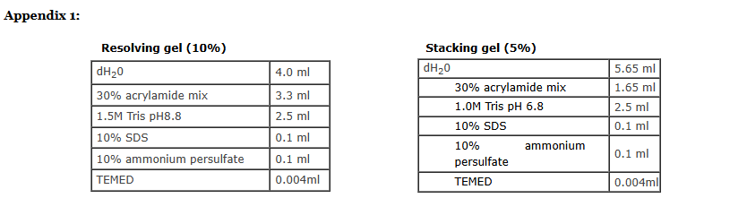

### Materials Required For PAGE
 

 Acrylamide solutions (for resolving & stacking gels).
 
 Isopropanol / distilled water .
 
 Gel loading buffer.
 
 Running buffer.
 
 Staining, destaining solutions.
 
 Protein samples .
 
 Molecular weight markers.

 

<b>The equipment and supplies necessary for conducting SDS-PAGE includes:</b>

 

An electrophoresis chamber and power supply.

Glass plates(a short and a top plate).

Casting frame .

Casting stand.

Combs .

 

<b>Note:</b>

 

Gloves should be worn, while performing SDS-PAGE.
To ensure proper alignment, all the requirements should be clean.
Special attention should be paid while using acrylamide(since it is a neurotoxin).
 

### Reagents

 

30% Polyacrylamide solution(29g acrylamide+1g bisacrylamide in 50 mL of water, dissolve completely using a magnetic stirrer, make the volume upto 100mL). Keep the solution away from sunlight.
1.5 M Tris, pH 8.8
1 M Tris, pH 6.8
10% SDS(10 g SDS in 100mL distilled water).
10% ammonium persulfate (0.1 g in 1 ml water). It should be freshly prepared.
10x SDS running buffer( pH ~8.3) - Take 60.6 g Tris base, 288g Glycine and 20g SDS in separate beakers and dissolve them using distilled water. When properly dissolved ,mix three of them and make upto 2L.(working standard is 1X buffer).

### Gel loading buffer:
 

<b>To make 10 mL of 4X stock:</b>

 

2.0 ml 1M Tris-HCl pH 6.8.
0.8 g SDS.
4.0 ml 100% glycerol.
0.4 ml 14.7 M β-mercaptoethanol.
1.0 ml 0.5 M EDTA.
8 mg bromophenol Blue.

 

<b>Staining solution:</b>

 

Weigh 0.25g of Coomassie Brilliant Blue R250 in a beaker. Add 90 ml methanol:water (1:1 v/v) and 10ml of Glacial acetic acid ,mix properly using a magnetic stirrer. (when properly mixed, filter the solution through a Whatman No. 1 filter to remove any particulate matter and store in appropriate bottles)

 

<b>Destaining solution:</b>

 

Mix 90 ml methanol:water (1:1 v/v) and 10ml of Glacial acetic acid using a magnetic stirrer and store in appropriate bottles.

### Procedure:
 

<b>Assembling the glass plates:</b>
 

1. Assemble the glass plate on a clean surface. Lay the longer glass plate(the one with spacer) down first, then place the shorter glass plate on top of it.

2. Embed them into the casting frame and clamp them properly Make sure that the that the bottom ends of the glass plates are properly aligned.

3. Then place it on the casting stand.
 

<b>Casting the gels:</b>
 

Prepare 10%of  resolving gel and 4.5% of stacking gel.

 

<b> NOTE:Please refer to appendix 1 for the recipe.</b>

 

1. Prepare the separating gel solution by combining all reagents. Do not add Ammonium per sulfate and TEMED.

2. Add APS and TEMED to the monomer solution(just before pouring ) and mix well by swirling gently. Pour the solution till the mark. (It is ok if you introduce air bubbles, add a layer of isopropanol or distilled water on top of the gel so as to level the poured gel.)

3. Allow the gel to polymerize for 20-30 minutes .

4. Prepare stacking gel. Mix all reagents except APS and TEMED. Drain the isopropanol with strips of filter paper .

5. Add APS and TEMED to the monomer solution(just before pouring ) and mix well by swirling gently. (Make sure you keep the comb ready by the side.)

6. Place a comb in the stacking gel sandwich. Allow it to polymerize for 10 minutes.
 

<b>Preparation of samples:</b>
 

Mix your protein in the ratio 4:1 with the sample buffer. Heat your sample by either:

      a) Boiling for 5-10 minutes. (Works for most proteins.)
      b) 65°C for 10 minutes.
      c) 37°C for 30 minutes.

 

<b>Running the gel:</b>
 

<b> Note : Before running the gel make sure that the gel, gel apparatus and samples are ready.</b>

 

1. To assemble, take out the gels from the casting frame and clamp them in the gel apparatus.( Make sure that the short plate always faces inside and if you have got only one gel to run use the dummy plate that is available to balance).

2. When the plates are secured, place them in the cassette and then lock it.

3. Place them in the gel running tank.

4. Fill the inner chamber of the tank with buffer.(Now it is easy to remove the comb, since it is lubricated).

5. Remove the comb CAREFULLY(without breaking the well).
[Now the gel is ready to load the samples]
Rinse the loading tip a few times with distilled water.  (Make sure that all the water is poured out before loading the samples.)
Insert the loading tip to a few mm from the well bottom and deliver the samples into the well. Rinse the syringe with distilled water after loading for a few times .
Attach the power supply by putting the lid (Make sure that the connection is in correct way ie., black -  black and red - red). Set the voltage upto 180 V and run for 1 hour.(Don't allow the dye front to go out of the gel).
 

<b>Staining the gel:</b>
 

After running, switch off the power supply and take out the gel plates, remove the gel. Place the gel in the staining solution for 30 minutes. Destain the gel until the bands are properly seen. Determine the approximate molecular weight of the visualised protein bands by comparing them with the molecular weight ladders(markers).

 

### Applications:
 

a) To identify whether a particular protein is pure or not.

b) Separation of proteins, prior to Western Blot transfer.

c) Species identification.

d) Antigen preparation.

e) To measure genetic diversity.
 
