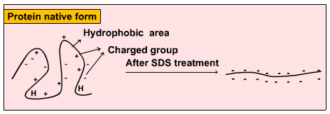
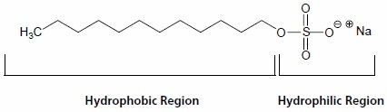

### Theory

PAGE (Polyacrylamide Gel Electrophoresis), is an analytical method used to separate components of a protein mixture based on their size. The technique is based upon the principle that a charged molecule will migrate in an electric field towards an electrode with opposite sign.The general electrophoresis techniques cannot be used to determine the molecular weight of biological molecules because the mobility of a substance in the gel depends on both charge and size. To overcome this, the biological samples needs to be treated so that they acquire uniform charge, then the electrophoretic mobility depends primarily on size. For this different protein molecules with different shapes and sizes, needs to be denatured(done with the aid of SDS) so that the proteins lost their secondary, tertiary or quaternary structure .The proteins being covered by SDS are negatively charged and when loaded onto a gel and placed in an electric field, it will migrate towards the anode (positively charged electrode) are separated by a molecular sieving effect based on size. After the visualization by a staining (protein-specific) technique, the size of a protein can be calculated by comparing its migration distance with that of a known molecular weight ladder(marker).

