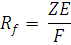
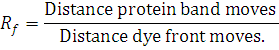
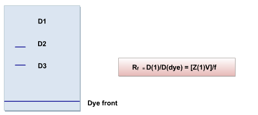

### Theory

PAGE (Polyacrylamide Gel Electrophoresis), is an analytical method used to separate components of a protein mixture based on their size. The technique is based upon the principle that a charged molecule will migrate in an electric field towards an electrode with opposite sign.The general electrophoresis techniques cannot be used to determine the molecular weight of biological molecules because the mobility of a substance in the gel depends on both charge and size. To overcome this, the biological samples needs to be treated so that they acquire uniform charge, then the electrophoretic mobility depends primarily on size. For this different protein molecules with different shapes and sizes, needs to be denatured(done with the aid of SDS) so that the proteins lost their secondary, tertiary or quaternary structure .The proteins being covered by SDS are negatively charged and when loaded onto a gel and placed in an electric field, it will migrate towards the anode (positively charged electrode) are separated by a molecular sieving effect based on size. After the visualization by a staining (protein-specific) technique, the size of a protein can be calculated by comparing its migration distance with that of a known molecular weight ladder(marker).

### Principle behind separation:
 

Separation of charged molecules in an electric field is based on the relative mobility of charged species which is related to frictional resistance.

 

### Charge of the species:
 

PAGE is working upon the principle in which, the charged molecule will migrate towards the oppositive charged electrode through highly cross linked matrix. Separation occurs due to different rates of migration occurs by the  magnitude of charge and frictional resistance related to  the size.

 

### Relative Mobility:

where,

Z = charge on the molecule

E = Voltage applied

and ,

f = frictional resistance

 

Rf is measured by:

Direction of movement is determined from  Z: -

if Z < 0, then →+

if Z > 0, then → -

if Z = 0, then no movement

 

The gel used is divided into an upper "stacking" gel of low percentage (with large pore size) and low pH (6.8), where the protein bands get squeezed down as a  thin layer migrating toward the anode and a resolving gel (pH  8.8) with smaller pores. Cl - is the only mobile anion present in both gels. When electrophoresis begins, glycine present in the electrophoresis buffer, enters the stacking gel, where the equilibrium favors zwitterionic form with zero net charge. The glycine front moves through the stacking gel slowly, lagging behind the strongly charged, Cl- ions. Since these two current carrying species separate, a region of low conductivity, with high voltage drop, is formed between them. This zone sweeps the proteins through the large pores of the stacking gel,  and depositing it at the top of the resolving gel as a narrow band.

 

Stacking gel interactions:
 

Stacking occurs by the differential migration of ionic species, which carry the electric current through the gel. When an electrical current is applied to the gel, the negatively charged molecules start migrating to the positively charged electrode. Cl- ions, having the highest charge/mass ratio move faster, being depleted and concentrated at anode end. SDS coated proteins has a higher charge/mass ratio than glycine so it moves fast, but slower than Cl-. When protein encounters resolving gel it slows the migration because of increased frictional resistance, allowing  the protein to stack in the gel.

 

Resolving Gel Interactions:
 

When glycine reaches resolving gel it becomes negatively charged and migrates much faster than protein due to higher charge/mass ratio. Now proteins are the main carrier of current and separate according to their molecular mass by the sieving effect of pores in gel.
